# YOLOV4

### 前言

YOLOV4的论文：[YOLOv4: Optimal Speed and Accuracy of Object Detection](https://arxiv.org/abs/2004.10934)，源代码：[Darknet](https://github.com/AlexeyAB/darknet)，官方网站：[YOLO官网](https://pjreddie.com/darknet/yolo/)。从YOLOV4的论文来看，该算法是整合前面的一些训练技巧，提高目标检测效率，比如加权残差链接（WRC），跨阶段部分链接（CSP），跨小批量标准化（CmBN），自对抗训练（SAT），Mish激活，马赛克数据增强，DropBlock正则化，CIoU Loss等等。算法用到的技巧需要查阅相关的论文才知道。关于训练技巧论文可以查看：[Bag of Freebies for Training Object Detection Neural Networks](https://arxiv.org/abs/1902.04103)和[Bag of Tricks for Image Classification with Convolutional Neural Networks](https://arxiv.org/abs/1812.01187)。

#### 算法性能

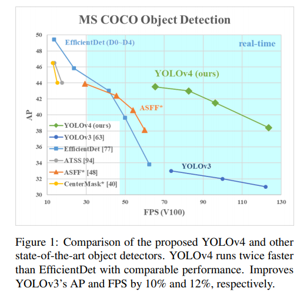

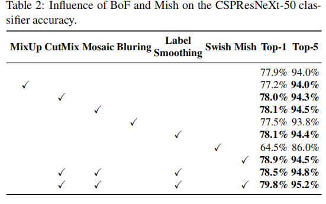

  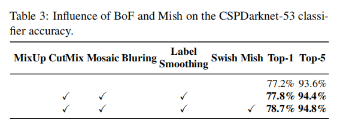

  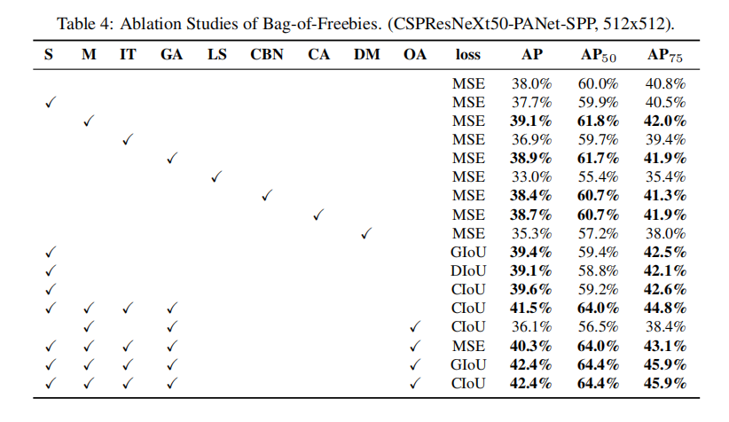

  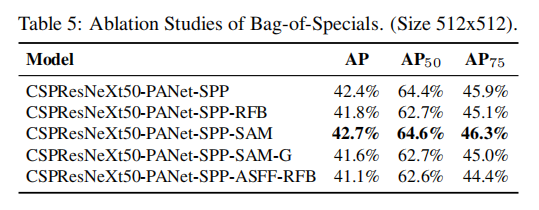

| Model                  | Test Size | APtest    | AP50test  | AP75test  | APStest   | APMtest   | APLtest   |
| :--------------------- | --------- | --------- | --------- | --------- | --------- | --------- | --------- |
| **YOLOv4**             | 640       | 50.0%     | 68.4%     | 54.7%     | 30.5%     | 54.3%     | 63.3%     |
| **YOLOv4**pacsp-s      | 640       | 39.0%     | 57.8%     | 42.4%     | 20.6%     | 42.6%     | 50.0%     |
| **YOLOv4**pacsp        | 640       | 49.8%     | 68.4%     | 54.3%     | 30.1%     | 54.0%     | 63.4%     |
| **YOLOv4**pacsp-x      | 640       | **52.2%** | **70.5%** | **56.8%** | **32.7%** | **56.3%** | **65.9%** |
| **YOLOv4**pacsp-s-mish | 640       | 40.8%     | 59.5%     | 44.3%     | 22.4%     | 44.6%     | 51.8%     |
| **YOLOv4**pacsp-mish   | 640       | 50.9%     | 69.4%     | 55.5%     | 31.2%     | 55.0%     | 64.7%     |
| **YOLOv4**pacsp-x-mish | 640       | 52.8%     | 71.1%     | 57.5%     | 33.6%     | 56.9%     | 66.6%     |

YOLOV4的贡献如下：

1. Develope an efficient and powerful object detection model.
2. Verify the influence of state-of-the-art Bag-of-Freebies and Bag-of-Specials methods of object detection during the detector training
3. Modify state-of-the-art methods and make them more effecient and suitable for single GPU training, including CBN(Cross-iteration batch normalization), PAN(Path aggregation network for instance segmentation), Sam(CBAM: Convolutional block attention module)。

### 网络结构

通用的目标检测网络结构如下所示：

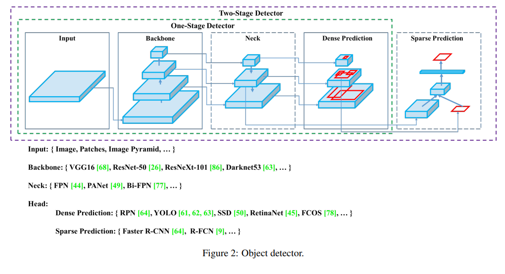

一个目标检测模型要检测效果好需要以下几点：

- 更大的网络输入分辨率——用于检测小目标
- 更深的网络层——能够覆盖更大面积的感受野
- 更多的参数——更好的检测同一图像内不同size的目标

那么需要考虑到几方面的平衡：输入网络分辨率/卷积层数量/参数数量/输出维度。YOLOv4模型 =` CSPDarkNet53` + `SPP` + `PANet(path-aggregation neck)` + `YOLOv3-head`，主要解释如下：

- SPP来源于`Kaiming He`的`SPP Net`，主要因为它显著增加了感受野，分离出最重要的上下文功能，并且几乎不降低网络操作速度。
- [PANet](https://arxiv.org/abs/1803.01534)主要是特征融合的改进。
- YOLOv3-head，因为是anchor-base方法，因此分类、回归分支没有改变。

它的网络结构图如下所示：

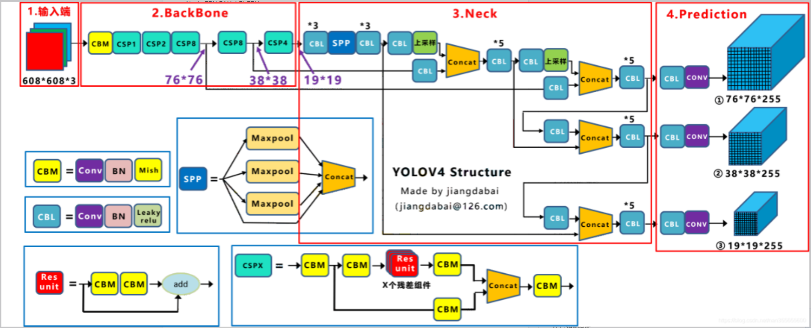

#### Backbone

YOLOV4采用的是CSPDarknet53作为网络的骨干，即特征提取部分，后续的算法也同样使用到CSPDarknet。当然也可以使用VGGNet、InceptionNet或者ResNet作为骨干网络。

##### Darknet

Darknet结合Resnet的特点在保证对特征进行超强表达的同时又避免了网络过深带来的梯度问题。Darknet-53的网络结构图如下所示：

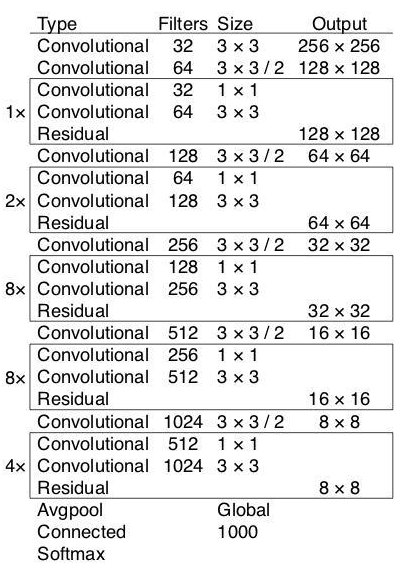

pytorch的实现如下：

1. 封装卷积

```python
class Conv(nn.Module):
	def __init__(self, c_in, c_out, k, s, p, bias=True):
		"""
		自定义一个卷积块，一次性完成卷积+归一化+激活，这在类似于像DarkNet53这样的深层网络编码上可以节省很多代码
		:param c_in: in_channels
		:param c_out: out_channels
		:param k: kernel_size
		:param s:  stride
		:param p: padding
		:param bias: …
		"""
		super(Conv, self).__init__()
		self.conv = nn.Sequential(
			nn.Conv2d(c_in, c_out, k, s, p),
			nn.BatchNorm2d(c_out),
			nn.LeakyReLU(0.1),
		)

	def forward(self, entry):
		return self.conv(entry)
```

2. 残差单元

```python
class ConvResidual(nn.Module):
	def __init__(self, c_in):		# converlution * 2 + residual
		"""
		自定义残差单元，只需给出通道数，该单元完成两次卷积，并进行加残差后返回相同维度的特征图
		:param c_in: 通道数
		"""
		c = c_in // 2
		super(ConvResidual, self).__init__()
		self.conv = nn.Sequential(
			Conv(c_in, c, 1, 1, 0),		 # kernel_size = 1进行降通道
			Conv(c, c_in, 3, 1, 1),		 # 再用kernel_size = 3把通道升回去
		)

	def forward(self, entry):
		return entry + self.conv(entry)	 # 加残差，既保留原始信息，又融入了提取到的特征
# 采用 1*1 + 3*3 的形式加深网络深度，加强特征抽象
```

3. 组装

```python
class Darknet53(nn.Module):
	def __init__(self):
		super(Darknet53, self).__init__()
		self.conv1 = Conv(3, 32, 3, 1, 1)			# 一个卷积块 = 1层卷积
		self.conv2 = Conv(32, 64, 3, 2, 1)
		self.conv3_4 = ConvResidual(64)				# 一个残差块 = 2层卷积
		self.conv5 = Conv(64, 128, 3, 2, 1)
		self.conv6_9 = nn.Sequential(				# = 4层卷积
			ConvResidual(128),
			ConvResidual(128),
		)
		self.conv10 = Conv(128, 256, 3, 2, 1)
		self.conv11_26 = nn.Sequential(				# = 16层卷积
			ConvResidual(256),
			ConvResidual(256),
			ConvResidual(256),
			ConvResidual(256),
			ConvResidual(256),
			ConvResidual(256),
			ConvResidual(256),
			ConvResidual(256),
		)
		self.conv27 = Conv(256, 512, 3, 2, 1)
		self.conv28_43 = nn.Sequential(				# = 16层卷积
			ConvResidual(512),
			ConvResidual(512),
			ConvResidual(512),
			ConvResidual(512),
			ConvResidual(512),
			ConvResidual(512),
			ConvResidual(512),
			ConvResidual(512),
		)
		self.conv44 = Conv(512, 1024, 3, 2, 1)
		self.conv45_52 = nn.Sequential(				# = 8层卷积
			ConvResidual(1024),
			ConvResidual(1024),
			ConvResidual(1024),
			ConvResidual(1024),
		)

	def forward(self, entry):
		conv1 = self.conv1(entry)
		conv2 = self.conv2(conv1)
		conv3_4 = self.conv3_4(conv2)
		conv5 = self.conv5(conv3_4)
		conv6_9 = self.conv6_9(conv5)
		conv10 = self.conv10(conv6_9)
		conv11_26 = self.conv11_26(conv10)
		conv27 = self.conv27(conv11_26)
		conv28_43 = self.conv28_43(conv27)
		conv44 = self.conv44(conv28_43)
		conv45_52 = self.conv45_52(conv44)
		return conv45_52, conv28_43, conv11_26		# YOLOv3用，所以输出了3次特征
```

##### CSPDarknet

Yolov4对Darknet53进行改进，借鉴[CSPNet](https://arxiv.org/pdf/1911.11929v1.pdf)(Cross Stage Partial Networks:跨阶段局部网络)。其解决了其他大型卷积神经网络框架Backbone中网络优化的梯度信息重复问题，将梯度的变化从头到尾地集成到特征图中，因此减少了模型的参数量和FLOPS(floating point operations per second)数值，既保证了推理速度和准确率，又减少了模型尺寸。

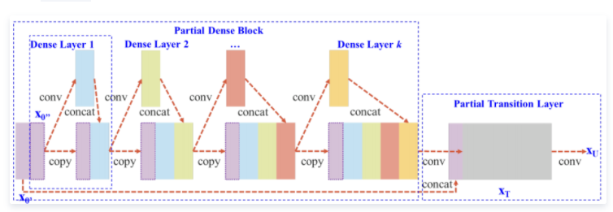

`CSPNet`实际上是基于`Densnet`的思想，复制基础层的特征映射图，通过`dense block`发送副本到下一个阶段，从而将基础层的特征映射图分离出来。这样可以有效缓解梯度消失问题(通过非常深的网络很难去反推丢失信号) ，支持特征传播，鼓励网络重用特征，从而减少网络参数数量。`CSPNet`思想可以和`ResNet`、`ResNeXt`和`DenseNet`结合，目前主要有`CSPResNext50` 和`CSPDarknet53`两种改造`Backbone`网络。最终`CSPDarknet`等网络如下所示：

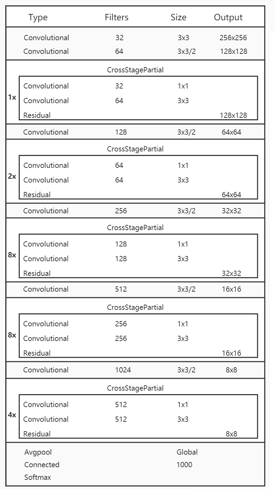

论文中给出CSPResNext50([CSPNET: A NEW BACKBONE THAT CAN ENHANCE LEARNING CAPABILITY OF CNN](https://arxiv.org/pdf/1911.11929v1.pdf))和CSPDarknet53对比：

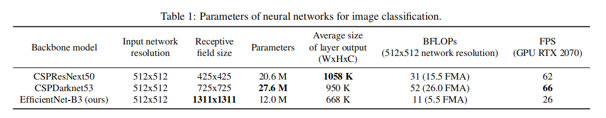

#### Neck

##### SPP结构

SPP结构来自：[Spatial Pyramid Pooling in Deep Convolutional Networks for Visual Recognition](https://arxiv.org/pdf/1406.4729v4.pdf)，在神经网络中输入图片的尺寸必须是固定的，这是因为在设计的时候FC层中神经元的个数都是固定的，导致输入图片尺寸必须是固定的。CNN是可以适应不同尺寸的输入图片，说明在CNN后面加入空间金字塔池（SPP）。就可以让FC层也适应不同尺寸的输入图片，

如下图，以`3`个尺寸的池化为例，对特征图进行一个最大值池化，即一张特征图得取其最大值，得到`1*d`(`d`是特征图的维度)个特征；对特征图进行网格划分为`2x2`的网格，然后对每个网格进行最大值池化，那么得到`4*d`个特征；同样，对特征图进行网格划分为`4x4`个网格，对每个网格进行最大值池化，得到`16*d`个特征。 接着将每个池化得到的特征合起来即得到固定长度的特征个数（特征图的维度是固定的），接着就可以输入到全连接层中进行训练网络了。用到这里是为了增加感受野。

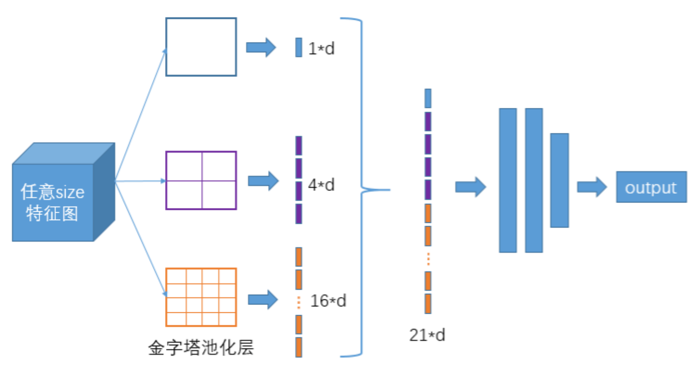

##### PAN结构

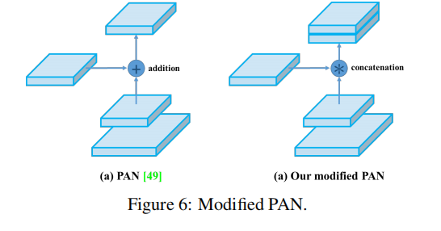

`YOLOv4`使用`PANet`(`Path Aggregation Network`)代替`FPN`进行参数聚合以适用于不同`level`的目标检测, `PANet`论文中融合的时候使用的方法是`Addition`，`YOLOv4`算法将融合的方法由加法改为`Concatenation`。

#### Detector

检测头使用的是YOLOV3的检测头，这里就不说了。

### 训练技巧

1. **Bag of freebies**：在训练上增加一些策略，达到更高的精度并且在测试的时候不会增加额外的时间策略，如图像增强，网络正则化，类别不平衡的处理方法。我的理解是提高检测速度。
2. **Bag og specials**：降低检测速度，提高精度。如增加模型感受野SPP，ASPP，RFB等，引入注意力机制Squeeze-and-Excitation(SE)等。

##### backbone

1. **数据增强**

  

Mosaic：

`Yolov4`的`Mosaic`数据增强是参考`CutMix`数据增强，理论上类似。区别在于`Mosaic`是一种将`4`张训练图像合并成一张进行训练的数据增强方法(而不是`CutMix`中的`2`张)。这增强了对正常背景(`context`)之外的对象的检测，丰富检测物体的背景。此外，每个小批包含一个大的变化图像(`4`倍)，因此，减少了估计均值和方差的时需要大`mini-batch`的要求，降低了训练成本。

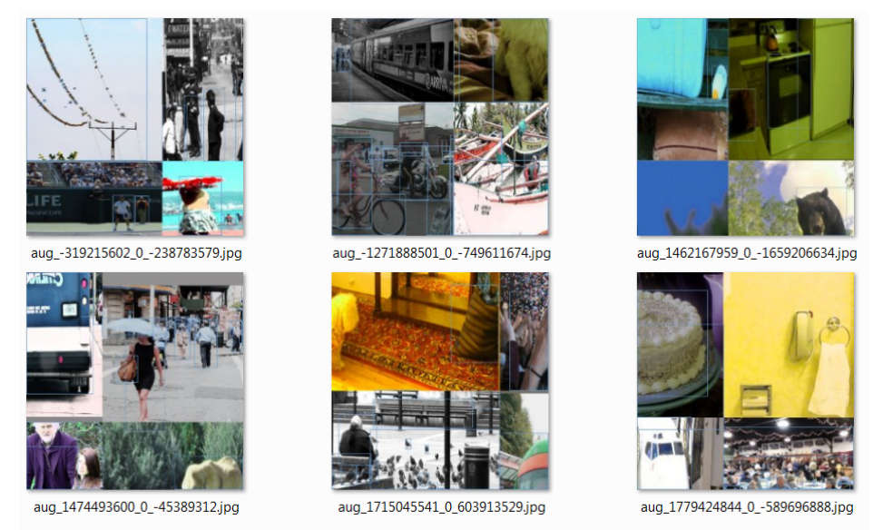

2. **DropBlock正则化**

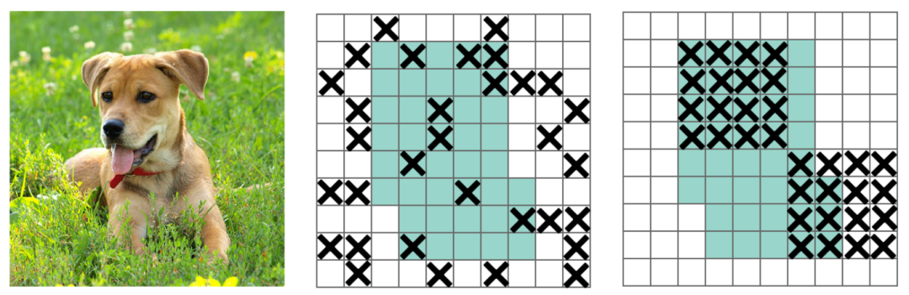

3. **类标签平滑**

对于分类问题，特别是多分类问题，常常把向量转换成`one-hot-vector`，而`one-hot`带来的问题： 对于损失函数，我们需要用预测概率去拟合真实概率，而拟合`one-hot`的真实概率函数会带来两个问题：

- 无法保证模型的泛化能力，容易造成过拟合；
- 全概率和`0`概率鼓励所属类别和其他类别之间的差距尽可能加大，而由梯度有界可知，这种情况很难适应。会造成模型过于相信预测的类别。

对预测有`100%`的信心可能表明模型是在记忆数据，而不是在学习。标签平滑调整预测的目标上限为一个较低的值，比如`0.9`。它将使用这个值而不是`1.0`来计算损失。这个概念缓解了过度拟合。说白了，这个平滑就是一定程度缩小`label`中`min`和`max`的差距，`label`平滑可以减小过拟合。所以，适当调整`label`，让两端的极值往中间凑凑，可以增加泛化性能。

##### 检测头

1. **CIoU-loss**

   - 经典IoU loss:

     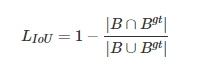

   - GIoU：[Generalized Intersection over Union: A Metric and A Loss for Bounding Box Regression](https://arxiv.org/abs/1902.09630)

     经典IoU loss存在以下两个问题：预测框bbox和ground truth bbox如果没有重叠，IOU就始终为0并且无法优化。也就是说损失函数失去了可导的性质。IOU无法分辨不同方式的对齐，例如方向不一致等，如下图所示，可以看到三种方式拥有相同的IOU值，但空间却完全不同。

     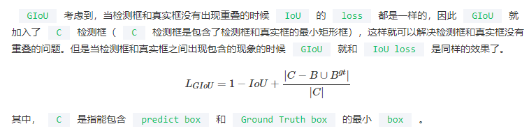

     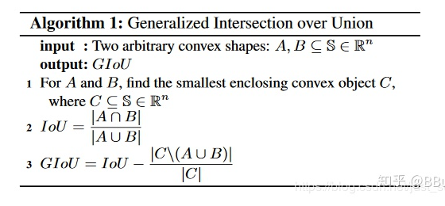

     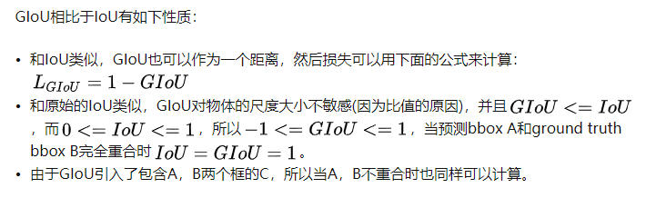

     ​	算法流程：

     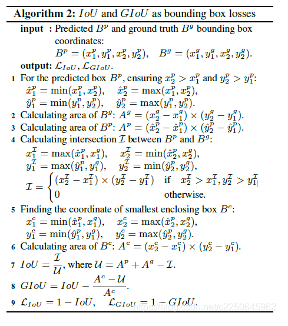

   - DIoU：[dinstance IoU](https://arxiv.org/pdf/1911.08287.pdf)

     解决预测框与GT重叠时，GIoU退化成IoU，导致在预测框bbox和ground truth bbox包含的时候优化变得非常困难，特别是在水平和垂直方向收敛难。

     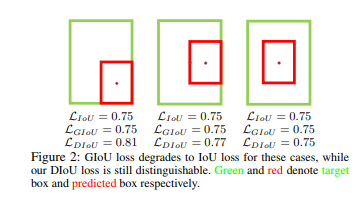

   - CIou：Complete IoU

     一个好的目标框回归损失应该考虑三个重要的几何因素：重叠面积，中心点距离，长宽比。GIoU为了归一化坐标尺度，利用IOU并初步解决了IoU为0无法优化的问题。然后DIoU损失在GIoU Loss的基础上考虑了边界框的重叠面积和中心点距离。所以还有最后一个点上面的Loss没有考虑到，即Anchor的长宽比和目标框之间的长宽比的一致性。

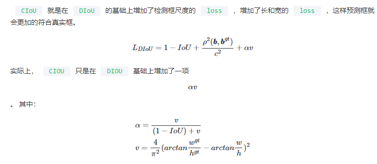

2. **CmBN策略**

  CBN在计算当前时刻统计量时考虑前K个时刻统计量，以此扩大batch size操作。

  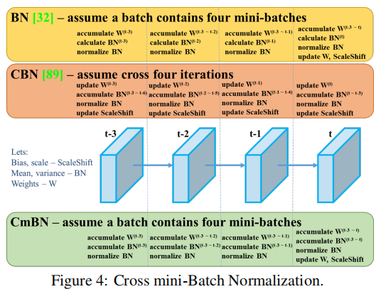

3. **自对抗训练(SAT)**

  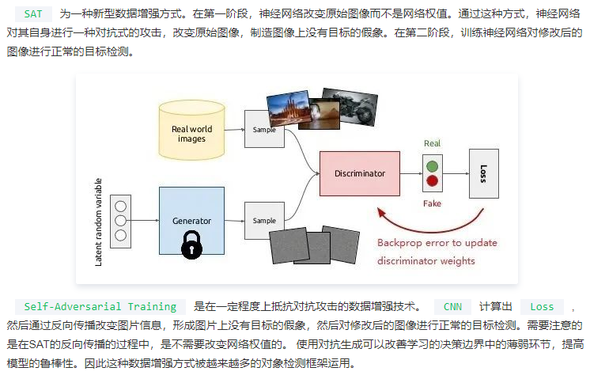

4. [遗传算法优化超参]( https://arxiv.org/pdf/2004.10934.pdf)

### 推理

##### backbone

1. **Mish激活函数**

   [Mish](https://arxiv.org/pdf/1908.08681.pdf)激活函数的公式如下：

   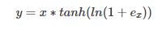

   Mish是一个平滑的曲线，平滑的激活函数允许更好的信息深入神经网络，，从而得到更好的准确性和泛化；在负值的时候并不是完全截断，允许比较小的负梯度流入。

   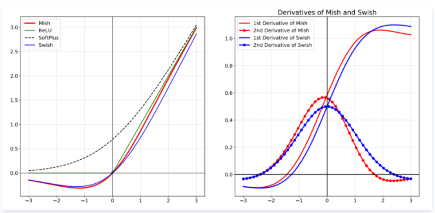


2. **MiWRC策略**（[BiFPN](https://arxiv.org/pdf/1911.09070.pdf)）

   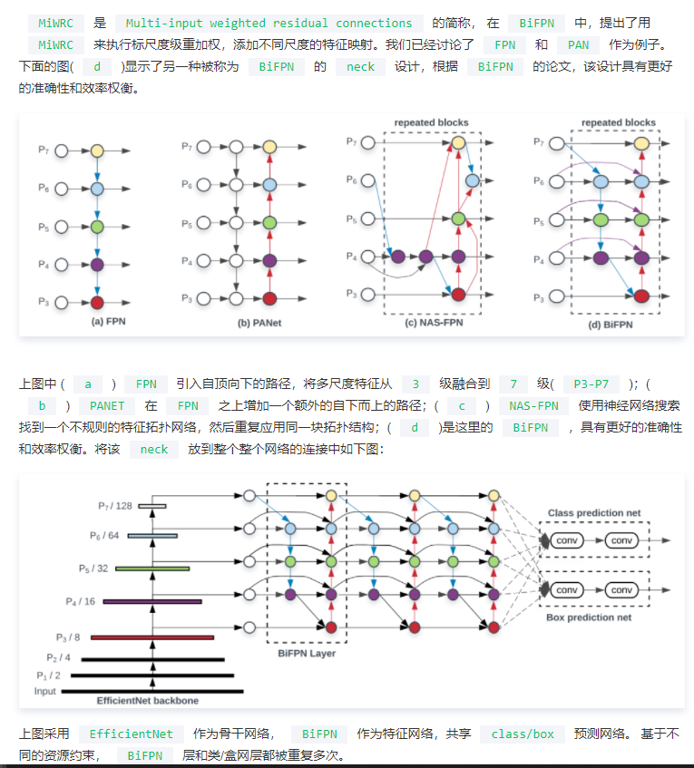

##### Detector

1. **SAM模块**

  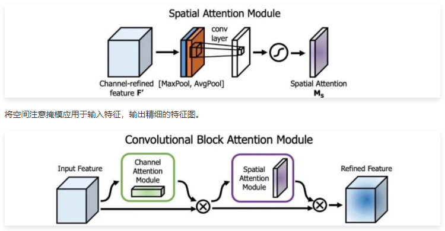

2. **DIoU-NMS**

  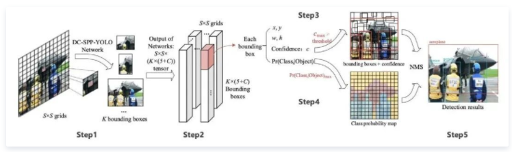

### 参考

1. [目标检测算法YOLOv4详解](https://cloud.tencent.com/developer/article/1748630)
2. [YOLOV4详解](https://blog.csdn.net/WhiffeYF/article/details/111405013)
