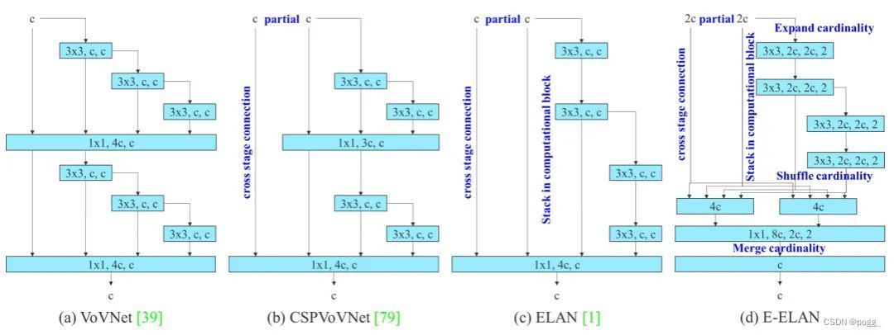
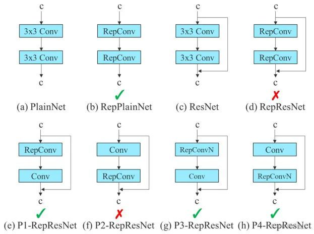
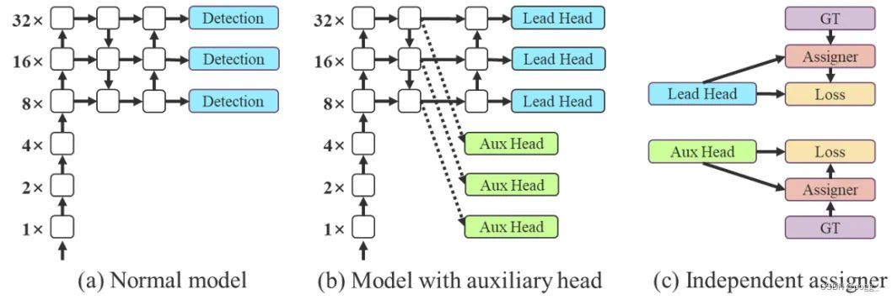
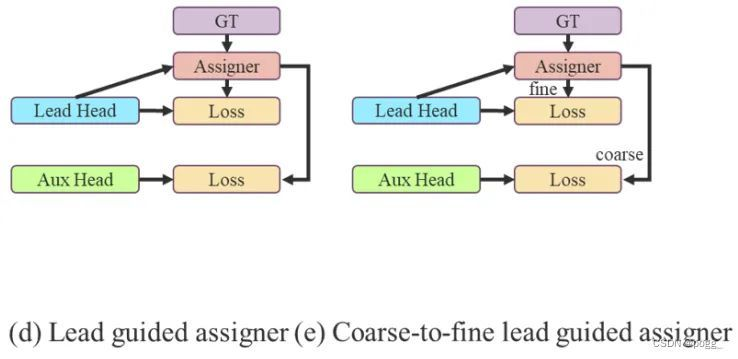

## YOLOV7

### 前言

YOLOV7论文：[YOLOv7: Trainable bag-of-freebies sets new state-of-the-art for real-time object detectors](https://arxiv.org/abs/2207.02696)，官方代码仓库：[YOLOV7](https://github.com/WongKinYiu/yolov7)，算法性能：

| Model                                                        | Test Size | APtest    | AP50test  | AP75test  | batch 1 fps |
| ------------------------------------------------------------ | --------- | --------- | --------- | --------- | ----------- |
| [**YOLOv7**](https://github.com/WongKinYiu/yolov7/releases/download/v0.1/yolov7.pt) | 640       | **51.4%** | **69.7%** | **55.9%** | 161 *fps*   |
| [**YOLOv7-X**](https://github.com/WongKinYiu/yolov7/releases/download/v0.1/yolov7x.pt) | 640       | **53.1%** | **71.2%** | **57.8%** | 114 *fps*   |
| [**YOLOv7-W6**](https://github.com/WongKinYiu/yolov7/releases/download/v0.1/yolov7-w6.pt) | 1280      | **54.9%** | **72.6%** | **60.1%** | 84 *fps*    |
| [**YOLOv7-E6**](https://github.com/WongKinYiu/yolov7/releases/download/v0.1/yolov7-e6.pt) | 1280      | **56.0%** | **73.5%** | **61.2%** | 56 *fps*    |
| [**YOLOv7-D6**](https://github.com/WongKinYiu/yolov7/releases/download/v0.1/yolov7-d6.pt) | 1280      | **56.6%** | **74.0%** | **61.8%** | 44 *fps*    |
| [**YOLOv7-E6E**](https://github.com/WongKinYiu/yolov7/releases/download/v0.1/yolov7-e6e.pt) | 1280      | **56.8%** | **74.4%** | **62.1%** | 36 *fps*    |

YOLOV7主要作出的贡献有：

1. 设计了几张可训练的`bag-of-freebies`，使实时检测器可以在不提高推理成本的情况下大大提高检测精度
2. 对于目标检测的发展，作者发现模块重参化能高效替代原始模块，以及动态标签分配策略能处理好不同输出层的分配
3. 作者为实施探测器提出了“extend”和“compound scaling”方法，可以更高效地利用参数和计算量的同时，具备更快的推理速度和更高的检测精度。

### 模型结构

#### 实时检测器

检测效果优秀的检测器需要具备以下特征：

- 更快和更高效的网络架构
- 更有效的特征积分方法
- 更准确的检测方法
- 更鲁棒的损失函数
- 更有效的标签分配方法
- 更有效的训练方式

#### 模型重参化

模型重参化策略在推理阶段将多个模块合并为一个计算模块，可以看作是一种集成技术，可以将其分为模块级集成和模型级集成两类。对于模型级重参化有两种常见的操作：

1. 用不同的训练数据训练多个相同的模型，然后对多个训练模型的权重进行平均
2. 对不同迭代次数下模型权重进行加权平均。

模块重参化是近年来一个比较流行的研究课题。这种方法在训练过程中将一个整体模块分割为多个相同或不同的模块分支，但在推理过程中将多个分支模块集成到一个完全等价的模块中。然而，并不是所有提出的重参化模块都可以完美地应用于不同的架构。考虑到这一点，作者开发了新的重参数化模块，并为各种架构设计了相关的应用程序策略。

#### 模型缩放

模型缩放通过扩大或缩小baseline，使其适用于不同的计算设备。模型缩放方法通常包括不同的缩放因子，如:

- input size（输入图像大小）
- depth（层数）
- width（通道数）
- stage（特征金字塔数量）

从而在网络的参数量、计算量、推理速度和精度方面实现很好的权衡。网络架构搜索(NAS)也是目前常用的模型缩放方法之一。

#### 高效的聚合网络

在大多数关于设计高效网络的论文中，主要考虑的因素是参数量、计算量和计算密度。但从内存访存的角度出发出发，还可以分析输入/输出信道比、架构的分支数和元素级操作对网络推理速度的影响（shufflenet论文提出)。在执行模型缩放时还需考虑激活函数，即更多地考虑卷积层输出张量中的元素数量。

在体系结构方面，E-ELAN只改变了计算模块中的结构，而过渡层的结构则完全不变。作者的策略是利用分组卷积来扩展计算模块的通道和基数，将相同的group parameter和channel multiplier用于计算每一层中的所有模块。然后，将每个模块计算出的特征图根据设置的分组数打乱成G组，最后将它们连接在一起。此时，每一组特征图中的通道数将与原始体系结构中的通道数相同。最后，作者添加了G组特征来merge cardinality。除了维护原始的ELAN设计架构外，E-ELAN还可以指导不同的分组模块来学习更多样化的特性。

### 训练技巧

#### 卷积重参化

尽管RepConv在VGG上取得了优异的性能，但将它直接应用于ResNet和DenseNet或其他网络架构时，它的精度会显著降低。作者使用梯度传播路径来分析不同的重参化模块应该和哪些网络搭配使用。通过分析RepConv与不同架构的组合以及产生的性能，作者发现RepConv中的identity破坏了ResNet中的残差结构和DenseNet中的跨层连接，这为不同的特征图提供了梯度的多样性。

#### 辅助训练模块

深度监督是一种常用于训练深度网络的技术，其主要概念是在网络的中间层增加额外的辅助头，以及以辅助损失为指导的浅层网络权重。即使对于像ResNet和DenseNet这样收敛效果好的网络结构，深度监督仍然可以显著提高模型在许多任务上的性能（这个和Nanodet Plus相似，按笔者理解可以当成是深层局部网络的ensemble，最后将辅助头和检测头的权重做融合）。下图(a)和(b)分别显示了“没有”和“有”深度监督的目标检测器架构，在本文中，作者将负责最终的输出头称为引导头，将用于辅助训练的头称为辅助头。

接下来讨论标签分配的问题。在过去，在深度网络的训练中，标签分配通常直接指的是ground truth，并根据给定的规则生成hard label（未经过softmax）。然而近年来，以目标检测为例，研究者经常利用网络预测的质量分布来结合ground truth，使用一些计算和优化方法来生成可靠的软标签（soft label）。例如，YOLO使用bounding box预测和ground truth的IoU作为软标签。在本文中，作者将网络预测结果与ground truth一起考虑后再分配软标签的机制称为“标签分配器”。无论辅助头或引导头，都需要对目标进行深度监督。那么，‘’如何为辅助头和引导头合理分配软标签？”，这是作者需要考虑的问题。目前最常用的方法如下图（c）所示，即将辅助头和引导头分离，然后利用它们各自的预测结果和ground truth执行标签分配。本文提出的方法是一种新的标签分配方法，通过引导头的预测来引导辅助头以及自身。换句话说，首先使用引导头的prediction作为指导，生成从粗到细的层次标签，分别用于辅助头和引导头的学习

**Lead head guided label assigner：** 引导头引导“标签分配器”预测结果和ground truth进行计算，并通过优化（在utils/loss.py的SigmoidBin(）函数中，传送门：[loss](https://github.com/WongKinYiu/yolov7/blob/main/utils/loss.py)生成软标签。这组软标签将作为辅助头和引导头的目标来训练模型。这样做的目的是使引导头具有较强的学习能力，由此产生的软标签更能代表源数据与目标之间的分布差异和相关性。此外，作者还可以将这种学习看作是一种广义上的余量学习。通过让较浅的辅助头直接学习引导头已经学习到的信息，引导头能更加专注于尚未学习到的残余信息。

**Coarse-to-fine lead head guided label assigner：** Coarse-to-fine引导头使用到了自身的prediction和ground truth来生成软标签，引导标签进行分配。然而，在这个过程中，作者生成了两组不同的软标签，即粗标签和细标签，其中细标签与引导头在标签分配器上生成的软标签相同，粗标签是通过降低正样本分配的约束，允许更多的网格作为正目标（可以看下FastestDet的label assigner，不单单只把gt中心点所在的网格当成候选目标，还把附近的三个也算进行去，增加正样本候选框的数量）。原因是一个辅助头的学习能力并不需要强大的引导头，为了避免丢失信息，作者将专注于优化样本召回的辅助头。对于引导头的输出，可以从查准率中过滤出高精度值的结果作为最终输出。然而，值得注意的是，如果粗标签的附加权重接近细标签的附加权重，则可能会在最终预测时产生错误的先验结果。

### 参考

1. [这是一篇对YOLOv7的详细解读和剖析](https://zhuanlan.zhihu.com/p/540068099)

