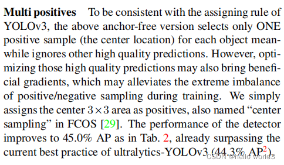
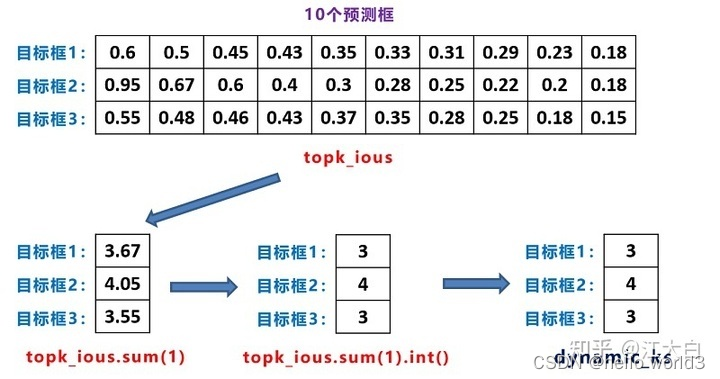
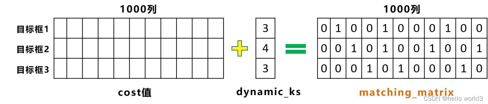

## YOLOX

### 前言

YOLOX论文：[YOLOX: Exceeding YOLO Series in 2021](https://arxiv.org/abs/2107.08430)，开源代码：[YOLOX Code](https://github.com/Megvii-BaseDetection/YOLOX)，知乎上作者的解释：[如何评价旷视开源的YOLOX，效果超过YOLOv5?](https://www.zhihu.com/question/473350307/answer/2021031747)。算法的性能如下：

标准模型的性能：

| Model                                                        | size | mAPval 0.5:0.95 | mAPtest 0.5:0.95 | Speed V100 (ms) | Params (M) | FLOPs (G) |
| ------------------------------------------------------------ | ---- | --------------- | ---------------- | --------------- | ---------- | --------- |
| [YOLOX-s](https://github.com/Megvii-BaseDetection/YOLOX/blob/main/exps/default/yolox_s.py) | 640  | 40.5            | 40.5             | 9.8             | 9.0        | 26.8      |
| [YOLOX-m](https://github.com/Megvii-BaseDetection/YOLOX/blob/main/exps/default/yolox_m.py) | 640  | 46.9            | 47.2             | 12.3            | 25.3       | 73.8      |
| [YOLOX-l](https://github.com/Megvii-BaseDetection/YOLOX/blob/main/exps/default/yolox_l.py) | 640  | 49.7            | 50.1             | 14.5            | 54.2       | 155.6     |
| [YOLOX-x](https://github.com/Megvii-BaseDetection/YOLOX/blob/main/exps/default/yolox_x.py) | 640  | 51.1            | **51.5**         | 17.3            | 99.1       | 281.9     |
| [YOLOX-Darknet53](https://github.com/Megvii-BaseDetection/YOLOX/blob/main/exps/default/yolov3.py) | 640  | 47.7            | 48.0             | 11.1            | 63.7       | 185.3     |

轻量化模型的性能：

| Model                                                        | size | mAPval 0.5:0.95 | Params (M) | FLOPs (G) | weights                                                      |
| ------------------------------------------------------------ | ---- | --------------- | ---------- | --------- | ------------------------------------------------------------ |
| [YOLOX-Nano](https://github.com/Megvii-BaseDetection/YOLOX/blob/main/exps/default/yolox_nano.py) | 416  | 25.8            | 0.91       | 1.08      | [github](https://github.com/Megvii-BaseDetection/YOLOX/releases/download/0.1.1rc0/yolox_nano.pth) |
| [YOLOX-Tiny](https://github.com/Megvii-BaseDetection/YOLOX/blob/main/exps/default/yolox_tiny.py) | 416  | 32.8            | 5.06       | 6.45      | [github](https://github.com/Megvii-BaseDetection/YOLOX/releases/download/0.1.1rc0/yolox_tiny.pth) |

### 网络结构

YOLOX的base line是YOLOV3，通过添加各种trick，得到YOLOX-Darknet53，结构图如下所示。要注意一点是`CBS`模块与YOLOV3中的`CBL`模块差不多，只不过是激活函数不同而已，`CBS`使用的是SiLU激活函数，`CBL`使用的是`LeakyRelu`激活函数。

#### Decoupled Head

关于Decouple的原理在[Revisiting the sibling head in object detector](https://arxiv.org/pdf/2003.07540.pdf)和[Rethinking classifification and localization for object detection](https://arxiv.org/pdf/1904.06493.pdf)做了详细的阐述。第一篇文章说明了之前的目标检测任务中，在同一个检测头检测物体的坐标以及物体分类对检测头无利，文章中把这种检测头成为sibling head。因为定位任务和分类任务关注部分不一样，这种失准（misalignment）可以通过简单的task-aware spatial disentanglement（TSD）来解决。这个方法原理是对某个实例进行观察，某些突出区域的特征有丰富的信息特征进行分类，而这些边界特征对边界回归有作用，如下图所示。因此TSD通过decouples两个任务而提高模型的效率。

在另一篇文章中，Rethinking classifification and localization for object detection经过分析也得出与第一篇文章的结论，即定位任务与分类任务的偏好是不一致，因此放在同一个检测头是不合理。除此之外，该文章分析FC层适合用于分类任务，而卷积头适合定位操作。因此该文章提出了双头检测这样一种结构，与当前YOLOX相似。

基于上面的背景，YOLOX提出以下的检测头。该结构除了能够提高检测性能，还可以提升收敛速度。但是将检测头解耦，会增加运算的复杂度。

YOLOX的检测头结构具体如下图所示：

#### Data Augmentation

在输入端进行`Mosaic`数据增强，但是我亲测过效果并不是特别好。另外要注意，`Mosaic`数据增强只在特定区域步长中才使用，比如前十步使用Mosaic增强，后面的训练就关闭。由于采取了更强的数据增强方式，作者在研究中发现，ImageNet预训练将毫无意义，因此，所有的模型均是从头开始训练的。

#### Anchor Free

关于Anchor Free可以参考以下论文：

- [Pp-yolov2: A practical object detector](https://arxiv.org/abs/2104.10419)
- [CornerNet: Detecting Objects as Paired Keypoints](https://arxiv.org/abs/1808.01244)
- [Objects as points](https://arxiv.org/abs/1904.07850)

回顾YOLOV3的方法，假设feature map某个网格中存在目标，则用基准的anchor去回归真实框，得到偏移量。而在YOLOX输出的feature map中，将模型中所有的预测框都囊括在85*8400的feature map中，里面包括不同尺度的预测框。可以查看下前面的网络结构。

Anchor Free 的好处是全方位的。1）Anchor Based 检测器为了追求最优性能通常会需要对anchor box 进行聚类分析，这无形间增加了算法工程师的时间成本； 2）Anchor 增加了检测头的复杂度以及生成结果的数量，将大量检测结果从NPU搬运到CPU上对于某些边缘设备是无法容忍的。当然还有； 3）Anchor Free 的解码代码逻辑更简单，可读性更高。

YOLOX检测出这些预测框信息，每张图像也有标注框的信息，这时需要做的是将模型8400预测框和图片上的目标框进行关联，挑选出正样本锚框。这里采用的关联方式是标签分配。原理是Multi positives和SimOTA。

#### Multi Positives

当有了8400个Anchor锚框后，这里的每一个锚框，都对应$85\times 8400$特征向量中的预测框信息。不过需要知道，这些预测框只有少部分是正样本，绝大多数是负样本。那么到底哪些是正样本呢？这里需要利用锚框和实际目标框的关系，挑选出一部分适合的正样本锚框。比如第3、10、15个锚框是正样本锚框，则对应到网络输出的8400个预测框中，第3、10、15个预测框，就是相应的正样本预测框。训练过程中，在锚框的基础上，不断的预测，然后不断的迭代，从而更新网络参数，让网络预测的越来越准。那么在Yolox中，是如何挑选正样本锚框的呢？这里就涉及到两个关键点：初步筛选、SimOTA。

#### SimOTA

关于OTA的参考论文：[OTA: Optimal Transport Assignment for Object Detection](https://arxiv.org/abs/2103.14259)。在SimOTA中，不同目标设定不同的正样本数量(dynamick)，以旷视科技官方回答中的蚂蚁和西瓜为例子，传统的正样本分配方案常常为同一场景下的西瓜和蚂蚁分配同样的正样本数，那要么蚂蚁有很多低质量的正样本，要么西瓜仅仅只有一两个正样本。对于哪个分配方式都是不合适的。动态的正样本设置的关键在于如何确定k，SimOTA具体的做法是首先计算每个目标Cost最低的10特征点，然后把这十个特征点对应的预测框与真实框的IOU加起来求得最终的k。这一部分就是对框进行筛选。首先进行初步的框筛选：

- 根据中心点判断：寻找anchor box中心点，落在gt_box矩形范围内的anchors

- 根据目标框来预测：以gt中心点为基准，设置边长为5的正方形，挑选正方形内所有的锚框。

经过初步筛选后则可以精细化筛选：

- 初筛正样本信息提取

- Loss函数计算

- cost成本计算

- SimOTA求解

精细化筛选在此主要讲述SimOTA，假设当前图像有3个目标框，针对初步筛选出的1000个的正样本进行进一步计算。

1. 首先计算1000个待处理的框以及3个gt_box计算分类损失cls_loss、位置损失iou_loss，置信度损失是将类别的条件概率和目标的先验概率做乘积。那么进一步根据cls_loss和iou_loss得到cost成本计算，维度为[3, 1000]，3表示的是3个预测框，1000表示待预测框。
2. 得到1000个预测框，那么可以挑选k个iou最大的候选框，topk_ious，这里k取10。这时候需要进一步确定dynamic_k。

通过上图，可以得知：目标框1和3，给他分配3个候选框，而目标框2，给它分配4个候选框。

3. 利用前面计算的cost值，即[3,1000]的损失函数加权信息。在for循环中，针对每个目标框挑选，相应的cost值最低的一些候选框。

4. 对于重复预测框对应不同的gt目标框，即第五列所对应的候选框，被目标检测框1和2，都进行关联。对这两个位置，还要使用cost值进行对比，选择较小的值，再进一步筛选。
5. 对筛选预测框进行loss计算，要注意的是这里的iou_loss和cls_loss，只针对目标框和筛选出的正样本预测框进行计算。而obj_loss，则还是针对8400个预测框。

### 训练技巧

这一部分可以参考[YOLOV5](./YOLOV5)，训练的技巧都大同小异。

### 参考

1. [YOLOX: Exceeding YOLO Series in 2021](https://arxiv.org/abs/2107.08430)
2. [YOLOX Code](https://github.com/Megvii-BaseDetection/YOLOX)
3. [如何评价旷视开源的YOLOX，效果超过YOLOv5?](https://www.zhihu.com/question/473350307/answer/2021031747)
4. [YOLOX的深入理解](https://blog.csdn.net/u012655441/article/details/123799503?ops_request_misc=%257B%2522request%255Fid%2522%253A%2522167137275316782425697020%2522%252C%2522scm%2522%253A%252220140713.130102334.pc%255Fblog.%2522%257D&request_id=167137275316782425697020&biz_id=0&utm_medium=distribute.pc_search_result.none-task-blog-2~blog~first_rank_ecpm_v1~rank_v31_ecpm-1-123799503-null-null.nonecase&utm_term=YOLOX&spm=1018.2226.3001.4450)
4. [YOLOX深度解析（二）-simOTA详解](https://zhuanlan.zhihu.com/p/394392992)。
6. [Anchor free系列网络之YOLOX源码逐行讲解篇(八)–simOTA标签匹配策略详解](https://aitechtogether.com/article/6888.html)
7. [深入浅出了解YOLOX](https://www.cvmart.net/community/detail/5347)