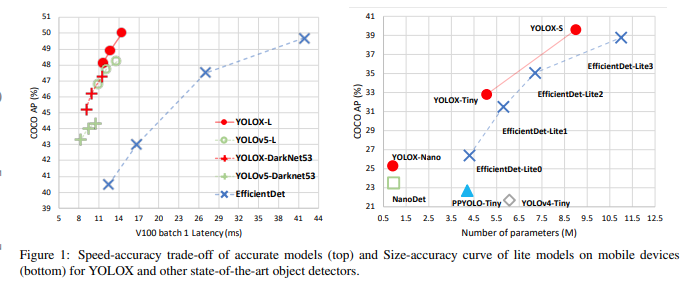
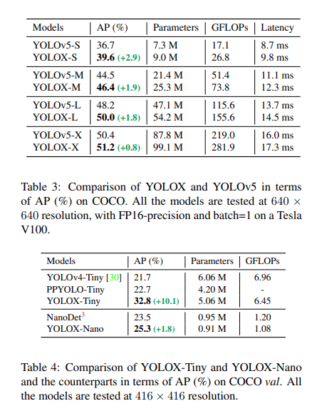
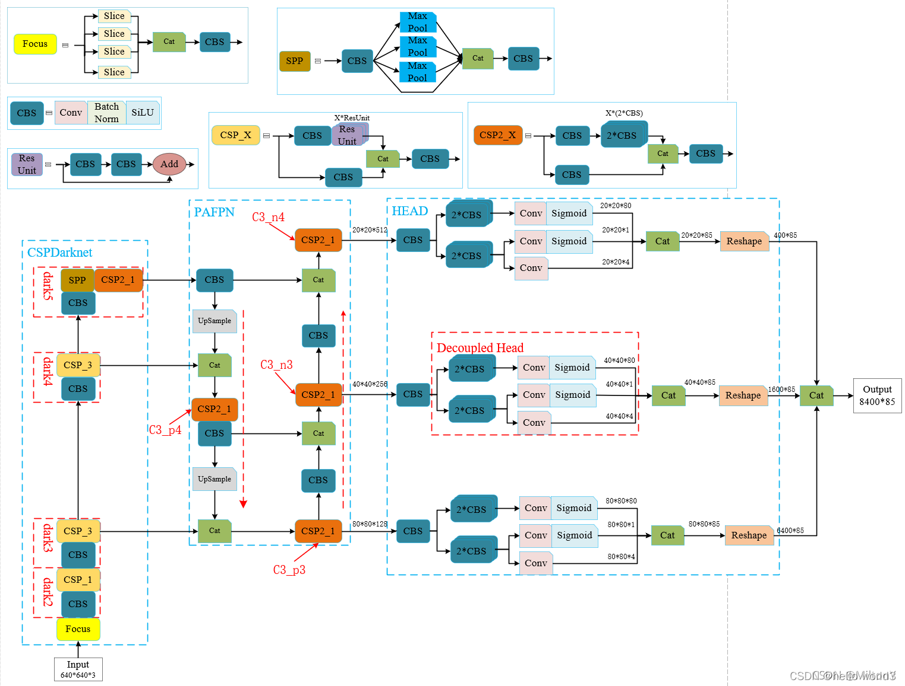
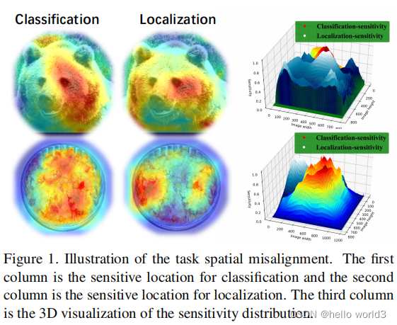
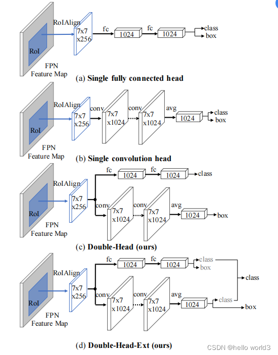
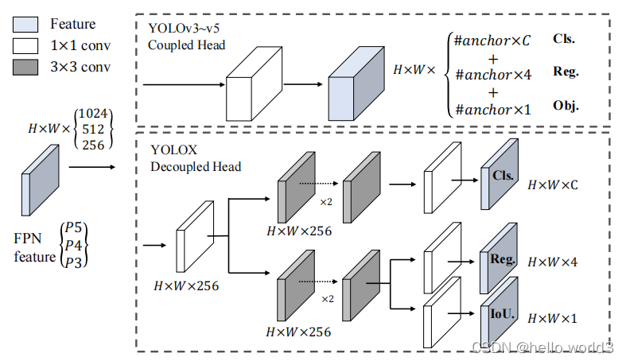
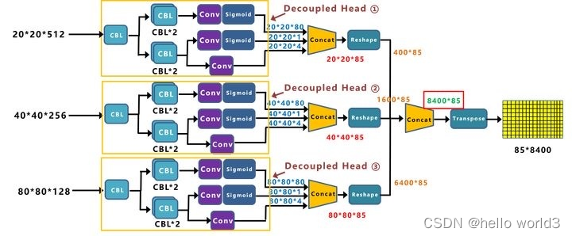

## YOLOX

### 前言

YOLOX论文：[YOLOX: Exceeding YOLO Series in 2021](https://arxiv.org/abs/2107.08430)，开源代码：[YOLOX Code](https://github.com/Megvii-BaseDetection/YOLOX)，知乎上作者的解释：[如何评价旷视开源的YOLOX，效果超过YOLOv5?](https://www.zhihu.com/question/473350307/answer/2021031747)。算法的性能如下：

标准模型的性能：

| Model                                                        | size | mAPval 0.5:0.95 | mAPtest 0.5:0.95 | Speed V100 (ms) | Params (M) | FLOPs (G) |
| ------------------------------------------------------------ | ---- | --------------- | ---------------- | --------------- | ---------- | --------- |
| [YOLOX-s](https://github.com/Megvii-BaseDetection/YOLOX/blob/main/exps/default/yolox_s.py) | 640  | 40.5            | 40.5             | 9.8             | 9.0        | 26.8      |
| [YOLOX-m](https://github.com/Megvii-BaseDetection/YOLOX/blob/main/exps/default/yolox_m.py) | 640  | 46.9            | 47.2             | 12.3            | 25.3       | 73.8      |
| [YOLOX-l](https://github.com/Megvii-BaseDetection/YOLOX/blob/main/exps/default/yolox_l.py) | 640  | 49.7            | 50.1             | 14.5            | 54.2       | 155.6     |
| [YOLOX-x](https://github.com/Megvii-BaseDetection/YOLOX/blob/main/exps/default/yolox_x.py) | 640  | 51.1            | **51.5**         | 17.3            | 99.1       | 281.9     |
| [YOLOX-Darknet53](https://github.com/Megvii-BaseDetection/YOLOX/blob/main/exps/default/yolov3.py) | 640  | 47.7            | 48.0             | 11.1            | 63.7       | 185.3     |

轻量化模型的性能：

| Model                                                        | size | mAPval 0.5:0.95 | Params (M) | FLOPs (G) | weights                                                      |
| ------------------------------------------------------------ | ---- | --------------- | ---------- | --------- | ------------------------------------------------------------ |
| [YOLOX-Nano](https://github.com/Megvii-BaseDetection/YOLOX/blob/main/exps/default/yolox_nano.py) | 416  | 25.8            | 0.91       | 1.08      | [github](https://github.com/Megvii-BaseDetection/YOLOX/releases/download/0.1.1rc0/yolox_nano.pth) |
| [YOLOX-Tiny](https://github.com/Megvii-BaseDetection/YOLOX/blob/main/exps/default/yolox_tiny.py) | 416  | 32.8            | 5.06       | 6.45      | [github](https://github.com/Megvii-BaseDetection/YOLOX/releases/download/0.1.1rc0/yolox_tiny.pth) |

### 网络结构

YOLOX的base line是YOLOV3，通过添加各种trick，得到YOLOX-Darknet53，结构图如下所示。要注意一点是`CBS`模块与YOLOV3中的`CBL`模块差不多，只不过是激活函数不同而已，`CBS`使用的是SiLU激活函数，`CBL`使用的是`LeakyRelu`激活函数。

#### Decoupled Head

关于Decouple的原理在[Revisiting the sibling head in object detector](https://arxiv.org/pdf/2003.07540.pdf)和[Rethinking classifification and localization for object detection](https://arxiv.org/pdf/1904.06493.pdf)做了详细的阐述。第一篇文章说明了之前的目标检测任务中，在同一个检测头检测物体的坐标以及物体分类对检测头无利，文章中把这种检测头成为sibling head。因为定位任务和分类任务关注部分不一样，这种失准（misalignment）可以通过简单的task-aware spatial disentanglement（TSD）来解决。这个方法原理是对某个实例进行观察，某些突出区域的特征有丰富的信息特征进行分类，而这些边界特征对边界回归有作用，如下图所示。因此TSD通过decouples两个任务而提高模型的效率。

在另一篇文章中，Rethinking classifification and localization for object detection经过分析也得出与第一篇文章的结论，即定位任务与分类任务的偏好是不一致，因此放在同一个检测头是不合理。除此之外，该文章分析FC层适合用于分类任务，而卷积头适合定位操作。因此该文章提出了双头检测这样一种结构，与当前YOLOX相似。

基于上面的背景，YOLOX提出以下的检测头。该结构除了能够提高检测性能，还可以提升收敛速度。但是将检测头解耦，会增加运算的复杂度。

YOLOX的检测头结构具体如下图所示：

#### Data Augmentation

#### Anchor Free

#### Label Assignment

### 训练技巧

### 参考

1. [YOLOX: Exceeding YOLO Series in 2021](https://arxiv.org/abs/2107.08430)
2. [YOLOX Code](https://github.com/Megvii-BaseDetection/YOLOX)
3. [如何评价旷视开源的YOLOX，效果超过YOLOv5?](https://www.zhihu.com/question/473350307/answer/2021031747)
4. [YOLOX的深入理解](https://blog.csdn.net/u012655441/article/details/123799503?ops_request_misc=%257B%2522request%255Fid%2522%253A%2522167137275316782425697020%2522%252C%2522scm%2522%253A%252220140713.130102334.pc%255Fblog.%2522%257D&request_id=167137275316782425697020&biz_id=0&utm_medium=distribute.pc_search_result.none-task-blog-2~blog~first_rank_ecpm_v1~rank_v31_ecpm-1-123799503-null-null.nonecase&utm_term=YOLOX&spm=1018.2226.3001.4450)